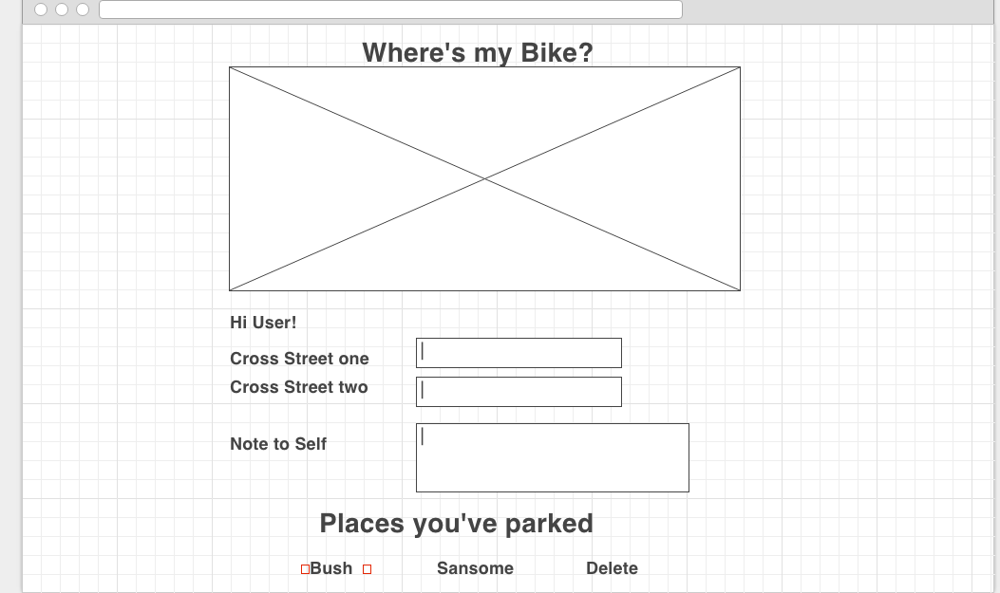

# Project01- Where's my Bike?

**"Only Thing We Have to Fear Is Fear Itself"** - *Melania Trump*

Full CRUD  with mongoose and Express.

## Overview

This project is a full-scale app built (mostly) from scratch and utilizes the following features:

* styled with Materialize
* RESTful design
* modularity using controllers
* get the data from the server using ajax and display it on the page with jQuery
* retrieve the data from the database
* functionality to create a new location
* functionality to remove/delete a location
* support storing location information (with full CRUD) (mongoose embedded)

## User login

Users can login via the slideout window on the left hand side of the app.

Passport is the middleware used to authenticate users and create sessions.

The app supports a one to many relatioship between users and locations.

## Features to come

* Google maps API/ pin feature to show visibly on a map where the bike is located
* Picture feature that allows you to capture a bike upon field entry.
